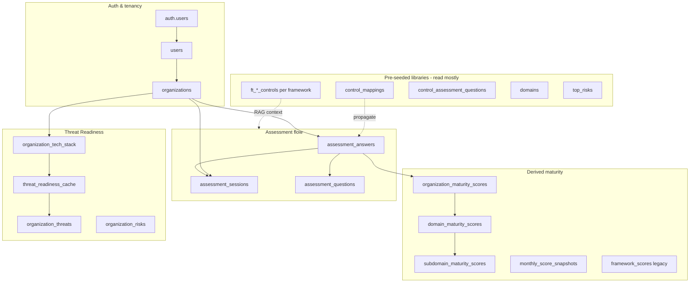

# Simplify.is — Demo prep & local walkthrough

> **Audience:** You, a co-founder, investor, or engineer seeing the product on **local dev** for the first time.  
> **Goal:** Understand what we built, why it matters, how the data flows, and how to run a demo that lands.  
> **Sources:** Notion Command Centre (`3179e9b1-def7-81a1-87c1-f462b297ce28`), repo docs (`SOURCE_OF_TRUTH.md`, May 2026 Notion sync), and agent work on demo accounts ([demo account provisioning](3cb23c99-f3b0-4000-8704-88cdaaed8130)).

**Sister docs:** [`Demo account.md`](./Demo%20account.md) · [`SOURCE_OF_TRUTH.md`](./SOURCE_OF_TRUTH.md) · [`SIMPLIFY_IS_FRAMEWORKS_AND_TESTING_HARNESS.md`](./SIMPLIFY_IS_FRAMEWORKS_AND_TESTING_HARNESS.md)

---

## Elevator pitch (30 seconds)

**Simplify.is** is a commercial AI security maturity platform. Users work with **Cypher** — a Claude-powered consultant — through structured assessments mapped to **nine global frameworks**. The product scores posture on a CMMI-style ladder, surfaces **executive dashboards** per framework, and generates **Threat Readiness** scenarios triangulated from tech stack + live maturity + industry context — not a generic 5×5 risk matrix.

It is **not** a chatbot and **not** a checkbox GRC tool. It feels like hiring a senior consultant who never forgets the last conversation, knows hundreds of controls across standards, and is available 24/7.

**Companion brand:** [vik.so](https://vik.so) — free RAG consultants and credibility layer. Same architectural philosophy; Simplify.is is the paid, structured assessment engine.

---

## What is the product?

### Problem we solve

Most organisations (roughly 50–5,000 employees) cannot afford a full-time CISO or $400–$800/hour consultants. Existing tools are checkbox forms with modern skins. Security maturity decays between audits; managers drown in administration instead of improvement.

### What users actually do

1. **Sign up** — Supabase Auth (email/password, MFA-capable).
2. **Onboard** — Organisation profile, industry, framework selection, consultant naming (“Cypher” by default, user-renamable forever).
3. **Discover tech stack** — Conversational Tech Stack Discovery (feeds Threat Readiness).
4. **Assess** — Discovery → scope → baseline by industry domains; form answers **or** Cypher chat; one consolidated question per control where possible.
5. **See posture** — Industry dashboard (default), nine framework executive views, Threat Readiness, maturity trends, roadmap/milestones (in progress).
6. **Export & operate** — PDF (spec), compliance cadence, threat refresh cron, reassessment triggers.

### Nine frameworks (all enabled on demo accounts)

| Slug | Standard |
|------|----------|
| `nist_csf_2_0` | NIST CSF 2.0 (Essential tier — always included) |
| `iso_27001_2022` | ISO 27001:2022 |
| `pci_dss_4_0` | PCI DSS 4.0 |
| `apra_cps_234` | APRA CPS 234 |
| `apra_cps_230` | APRA CPS 230 |
| `asd_essential_eight` | ASD Essential Eight |
| `iso_42001` | ISO/IEC 42001 (AI management) |
| `auva_iss` | AU Voluntary AI Safety Standard |
| `nist_ai_rmf` | NIST AI RMF |

Metadata lives in `lib/frameworks/library.ts` — single source for onboarding, marketing, and pricing grids.

### Plans (product positioning)

- **Essential** — NIST CSF 2.0 only (positioned ~AUD $290/mo in Notion).
- **Professional** — NIST + up to three additional frameworks (~AUD $590/mo).

Demo accounts have **all nine** enabled so every dashboard tab is visible.

---

## What is so great about it? (Wow factors)

Use these when you want someone to lean in — they come from the Notion **Wow Facts** / Solution Design (May 2026) and shipped engineering.

| Differentiator | Why it matters |
|----------------|----------------|
| **Conversational consultant** | Cypher-led discovery, assessment, tech stack, and threat generation — not “fill form 47 of 200”. |
| **16,343 cross-framework mappings** | Answer once; maturity propagates across frameworks via `control_mappings` + strength — hidden complexity, visible scores. |
| **898 controls, ~1 question each** | Consolidated assessment pipeline (`control_assessment_questions`, consolidated questions) — ~78% coverage on the seeded demo org. |
| **Threat triangulation** | Tech stack + live maturity + industry multipliers → personalised scenarios + **Key Levers** (not likelihood × impact theatre). |
| **Nine distinct executive dashboards** | Each framework gets its own executive chart module — rare in GRC tools. |
| **AI-first bundle** | ISO 42001 + AU Voluntary AI Safety + NIST AI RMF — timed for EU AI Act pressure (Aug 2026). |
| **Append-only answers** | Full audit trail in `assessment_answers`; `source` flag `form` \| `cypher`; monthly snapshots frozen by cron. |
| **Security architecture** | Three layers, RLS on every table, orchestration secret, no client-side service keys, JWT on every `/api/v1/*` route. |
| **Autonomous QA harness** | `npm run test:autonomous` — Karpathy-style grading, framework ID regex, cross-mapping consistency (see testing harness doc). |
| **Earthen Brutalism UI** | Warm, editorial, calm — deliberately not cyan-on-black “SOC SaaS”. |

**Scale in Supabase (simplify-dev):** ~3,615 assessment questions · 16,343 mappings · 415 question aliases · 898 controls across nine frameworks (per Notion May 2026 sync).

---

## How we are building it

### Locked stack

| Layer | Choice |
|-------|--------|
| App | Next.js 14 App Router, TypeScript strict, Tailwind |
| Data + Auth | Supabase (Postgres, RLS, Auth) — project `simplify-dev` |
| AI | Anthropic Claude — Sonnet for reasoning, Haiku for RAG ID resolution |
| Email / billing | Resend, Stripe |
| Deploy | Vercel (MVP) |
| Tests | Jest + Playwright + autonomous Cypher harness |

### Three-layer architecture (never bypass)

```
Browser / Client
      ↓ HTTPS
API layer          /api/v1/*     JWT, Zod, rate limits, audit_log
      ↓ x-orchestration-secret
Orchestration      /api/internal/* + orchestration/   Claude, RAG, scoring, threats
      ↓
Supabase           Postgres + RLS + pre-seeded framework libraries
```

**Rules that impress security reviewers:**

- No direct Supabase from React components — always API routes.
- No direct Anthropic calls from `/api/v1/*` — orchestration only.
- `SUPABASE_SERVICE_ROLE_KEY` and `ANTHROPIC_API_KEY` never in `NEXT_PUBLIC_*`.
- Parameterised SQL only; RLS on tenant data.

### How the product was built (velocity story)

From **zero to working multi-framework platform in ~5 weeks** (March–May 2026) using specialist **agent passes** — each owns one layer (foundation → orchestration → API → UI → security → onboarding → threats → assessment data). Notion timeline documents Agents 1–18; latest shipped work includes Threat Readiness, Tech Stack Discovery, industry multipliers, consolidated questions, and nine framework dashboards.

**Design:** Stitch PNGs + **Earthen Brutalism** tokens — Raleway / Montserrat / Josefin, warm surfaces (`#141311` app, `#1A1917` marketing), orange primary container `#f2632d`.

### RAG (three-pass — proven on vik.so)

1. **Explicit control IDs** in user message → fetch full control records from Supabase.
2. **Haiku semantic resolver** → map natural language to control IDs.
3. **Offline keyword fallback** → never fail closed on retrieval.

Version anchors always injected (ISO 27001 **2022** only; NIST CSF **2.0** only).

---

## What the database is doing

### Mental model



### Table groups (what to say in a demo)

#### Tenancy & identity

| Table | Role |
|-------|------|
| `users` | Extends `auth.users`; `org_id`, `agent_name` (Cypher rename), role, usage counters |
| `organizations` | Tenant root; `selected_frameworks`, industry, onboarding metadata, plan |
| `audit_log` | Every mutation logged (compliance story) |

#### Framework knowledge (pre-seeded — do not re-seed in prod)

| Table | Role |
|-------|------|
| `ft_iso_controls`, `ft_nist_controls`, … | Per-framework control text (~898 controls total) |
| `control_mappings` | **16,343 rows** — cross-framework propagation |
| `control_assessment_questions` | **~3,615** — source of truth for assessment copy |
| `question_aliases` | Consolidated / legacy key aliasing |
| `domains` | 21 industry-standard domains for Industry dashboard |
| `top_risk` templates | Seed organisation risks |

#### Assessment runtime

| Table | Role |
|-------|------|
| `assessment_sessions` | Active/completed sessions per framework |
| `assessment_questions` | Per-org question rows (FK targets for answers) |
| `assessment_answers` | **Append-only** user responses; triggers score recalc |
| `control_responses` | Legacy/alternate response path (older flows) |
| `chat_transcripts` | Cypher conversation history (RLS: user-private) |

#### Scoring outputs (what dashboards read)

| Table | Role |
|-------|------|
| `organization_maturity_scores` | Framework-level CMMI-style scores |
| `domain_maturity_scores` | Per-domain rollups |
| `subdomain_maturity_scores` | Finer granularity for charts |
| `monthly_score_snapshots` | Historical trend lines (cron on 1st of month) |
| `framework_scores` / `domain_scores` | Legacy paths; demo seed still populates |

#### Threat Readiness & tech stack

| Table | Role |
|-------|------|
| `organization_tech_stack` | Discovered stack profile |
| `tech_stack_discovery_sessions` / `_messages` | Conversational discovery state |
| `threat_readiness_cache` | Generated scenarios (24h TTL; cron refresh Tue/Fri) |
| `organization_threats` | Persisted threats + user bucket overrides |
| `organization_risks` | Top risks surfaced on dashboards |

Full size reference: [`Supabse-schema.md`](./Supabse-schema.md).

### What happens when someone answers a question

1. Answer lands in `assessment_answers` (append-only).
2. `recalculateAndPersistScores` updates org/domain/subdomain maturity tables.
3. Cross-framework propagation uses `control_mappings` (strength-weighted) — user sees one question, multiple frameworks benefit.
4. Threat cache may invalidate; severity uses stack + maturity + industry multipliers.
5. `audit_log` records the mutation path.

**Demo contrast:** `wdata@demo.com` has ~346 answers (~78% of consolidated controls) across all nine frameworks; `wodata@demo.com` is intentionally empty to prove backfill when you complete assessments live.

---

## Local development — first run

### Prerequisites

- Node 20+
- `.env.local` with Supabase URL, anon key, **service role key**, Anthropic key, `ORCHESTRATION_SECRET`
- Access to **simplify-dev** Supabase (shared dev DB — demo accounts live there)

### Start the app

```bash
cd simplify-is
npm install
cp .env.example .env.local   # fill values
npm run dev                  # http://localhost:3000
```

Set `NEXT_PUBLIC_USE_MOCKS=false` when you want dashboards to hit real APIs (mocks still warn in console if hooks fall back).

### Provision or refresh demo data

```bash
cd simplify-is && npx tsx scripts/provisionDemoAccounts.ts
# single account:
cd simplify-is && npx tsx scripts/provisionDemoAccounts.ts wdata@demo.com
```

Threat/tech stack refresh for seeded account:

```bash
node scripts/seedWdataThreatAndTech.mjs
```

Details: [`Demo account.md`](./Demo%20account.md).

---

## Demo accounts (use these locally or on simplify.is)

| Account | Password | Purpose |
|---------|----------|---------|
| `wdata@demo.com` | `123` | **Full story** — all dashboards populated, all 9 frameworks, ~346 answers, threat cache, tech stack, risks |
| `wodata@demo.com` | `123` | **Blank slate** — same frameworks enabled, empty scores; run assessments live to verify backfill |
| `vsoni@outlook.com` | _(your password)_ | Original seeded review account (reference) |

**Orientation replay:** `wdata@demo.com` resets onboarding steps 1–5 on **every login** (`lib/onboarding/replayOnboarding.ts`) — great for showing Cypher intro, framework picker, and initialisation flow repeatedly.

**Initialisation modal** (Industry dashboard overlay) is **browser `localStorage`** — use incognito or clear site data to see it again.

---

## Suggested walkthrough (15–20 minutes to impress)

### 1. Marketing shell (2 min)

- `/` — positioning, Earthen Brutalism, “consultant not checkbox” tone.
- `/how-it-works`, `/frameworks`, `/meet-cypher`, `/pricing` — nine frameworks and AI bundle story.

### 2. Login as `wdata@demo.com` (3 min)

- Watch **onboarding replay**: org profile → frameworks (nine selected) → meet Cypher → initialisation.
- Call out: server-side replay for demo; production users complete once.

### 3. Industry dashboard (4 min)

- `/dashboard/industry` — radar / domain maturity, industry context.
- If initialisation modal appears: Tech Stack Discovery as the hero path to Threat Readiness.

### 4. Framework executive views (3 min)

- `/dashboard/framework` — switch tabs across **nine** standards; each chart module is framework-specific (not one generic widget).

### 5. Threat Readiness (4 min)

- `/dashboard/threats` — scenario-centric threats, Key Levers panel, severity from **stack + maturity + industry** (explain why generic GRC risk matrices feel hollow).
- Optional: `/dashboard/tech-stack-discovery` — show how stack feeds threats.

### 6. Assessment + Cypher (4 min)

- `/dashboard/assessment` or active session — consolidated questions, dual path (form + chat).
- Mention append-only audit trail and cross-framework propagation.

### 7. The “builder” close (1 min)

- Open **Supabase** row counts or mention 16k mappings / 3.6k questions / autonomous test harness.
- Switch to `wodata@demo.com` only if you have time to show empty → filled journey.

---

## Key routes cheat sheet

| Route | What to show |
|-------|----------------|
| `/` | Brand, problem, Cypher promise |
| `/login` | Auth |
| `/onboarding/step-1` … `step-5` | First-time setup |
| `/dashboard/industry` | Default post-login home |
| `/dashboard/framework` | Nine executive dashboards |
| `/dashboard/threats` | Threat Readiness |
| `/dashboard/tech-stack-discovery` | Stack discovery chat |
| `/dashboard/assessment` | Assessment hub |
| `/assessment/[sessionId]` | Live assessment UI |

---

## Talking points for technical audiences

- **Why Claude + Supabase RAG, not fine-tuned local LLM:** vik.so proved accuracy; faster iteration; Haiku cheap for ID resolution.
- **Why Threat Readiness replaced “Risk View”:** boards want scenarios and levers, not heat-map theatre.
- **Why mappings are the moat:** N² work per new framework — content is not the bottleneck; calibration and mappings are.
- **Security:** RLS tenant isolation, orchestration secret, no secrets in client bundle — built for pen-test narrative.
- **What's still wiring:** Some `usePostLogin` paths mock when flags unset; Maturity Roadmap rebuild per Feedback §22–24; full PDF export — honest “beta surface” if asked.

---

## Notion & repo references

| Resource | Location |
|----------|----------|
| Notion Command Centre | Page ID `3179e9b1-def7-81a1-87c1-f462b297ce28` — sync via `notion_integration/update_may15_2026_simplify_comprehensive.js` |
| Build Log / Wow Facts | Child pages under same Notion tree (IDs in that script) |
| Product source of truth | `docs/SOURCE_OF_TRUTH.md` |
| Architecture rules | `CLAUDE.md` |
| Full MVP spec | `docs/SPEC.md` |
| Threat architecture decision | `docs/Notion_DECISION_DOCUMENT_THREAT_READINESS_ARCHITECTURE.md` |
| Demo account ops | `docs/Demo account.md` |
| Agent transcript (demo users) | [Create wdata/wodata demo accounts](3cb23c99-f3b0-4000-8704-88cdaaed8130) |

---

## Quick checklist before showing someone your laptop

- [ ] `npm run dev` running; `.env.local` points at simplify-dev
- [ ] `npx tsx scripts/provisionDemoAccounts.ts` run recently if dashboards look empty
- [ ] Logged in as `wdata@demo.com` / password `123`
- [ ] Incognito window ready if you need initialisation modal again
- [ ] `NEXT_PUBLIC_USE_MOCKS=false` if you want to stress “real API” paths
- [ ] This doc + `Demo account.md` open for credential fallback

---

*Last updated: May 2026 — aligned with Notion Solution Design refresh (15 May 2026) and demo account provisioning session.*
